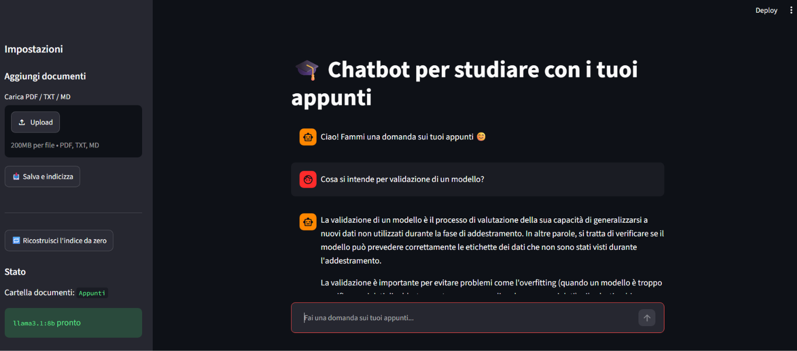
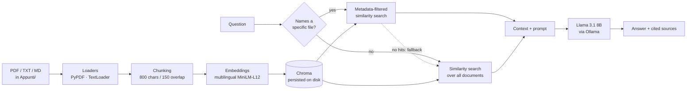

# UniBot — a fully local RAG chatbot for your university notes

Ask questions about your own lecture notes and get answers grounded in them, with the
source passages cited. Everything runs on your machine: documents, embeddings, vector
store and language model. No API keys, no cloud, no data leaving the laptop.

Built as a personal project to explore retrieval-augmented generation end to end.



---

## Why local

Lecture notes are course material that often cannot be uploaded to a third-party service,
and a study assistant is used dozens of times a day — exactly the pattern where per-token
API pricing hurts. Running the whole pipeline locally solves both: the documents never
leave the machine, and the marginal cost of a question is zero.

The trade-off is quality and latency: an 8B model on consumer hardware is weaker than a
frontier API model, which is why retrieval quality carries most of the weight here.

---

## Architecture



| Stage | Choice | Rationale |
|---|---|---|
| Chunking | `RecursiveCharacterTextSplitter`, 800 / 150 | Lecture slides are short and dense; small chunks keep a single concept per chunk, the overlap avoids cutting definitions in half. |
| Embeddings | `paraphrase-multilingual-MiniLM-L12-v2` | Notes are in Italian, questions often mix Italian and English technical terms. A multilingual model handles both; MiniLM is small enough to embed on CPU. |
| Vector store | Chroma, persisted to disk | Zero-setup, no server to run, survives restarts. |
| Generation | Llama 3.1 8B via Ollama, `temperature=0.01` | Largest model that runs comfortably on a laptop. Near-zero temperature because the task is extraction from context, not creative writing. |

---

## What is interesting here

**Incremental indexing.** Re-embedding every document on every start is the usual shortcut
and it becomes unusable past a few dozen files. Instead the index keeps a manifest
(`.index_manifest.json`) mapping each file to the SHA-256 of its contents and the ids of
the chunks it produced. On startup the manifest is compared against what is on disk, and
only added, modified or deleted files are touched — the chunk ids make removal of a stale
version exact rather than approximate.

**File-scoped retrieval.** When a question names a document ("what are the advantages of
CSEMAS", "in the file DTLA ..."), the search is first restricted to that document via
metadata filtering, and falls back to the whole corpus when the filter returns nothing.
This fixes the common failure where a question about one lecture retrieves chunks from
five others.

**Grounded answers.** The prompt constrains the model to the retrieved context and asks it
to say so explicitly when the answer is not there. Retrieved passages are shown in the UI
with file name and page number, so any claim can be checked against the source.

---

## Quickstart

Requires **Python 3.10+** and [Ollama](https://ollama.com) installed and running.

```bash
git clone https://github.com/SaponaraDavide/unibot.git
cd unibot

python -m venv venv
source venv/bin/activate        # Windows: venv\Scripts\activate
pip install -r requirements.txt

ollama pull llama3.1:8b         # one-off, ~4.7 GB

# put your PDFs / notes in Appunti/ (or upload them from the UI)
streamlit run app.py
```

The first run downloads the embedding model and builds the index; later runs only
reindex what changed.

On Windows, `UNIBOT.vbs` launches the app without a terminal window.

---

## Troubleshooting

**`ModuleNotFoundError: No module named 'torchvision'` on startup.**
Streamlit's hot-reload watcher walks the internals of every imported module,
which triggers `transformers`' lazy imports and pulls in optional dependencies
this project never uses. It is a watcher failure, not an application one. The
bundled `.streamlit/config.toml` disables the local module watcher, which is the
fix — installing `torchvision` would work too, but adds a gigabyte of unused
dependencies. With the watcher off, restart the app manually after code changes.

**The app hangs on "Loading..." the first time.**
The first run downloads the embedding model and indexes every document, which
takes minutes on a large corpus. Follow the `[INDEX]` lines in the terminal to
see progress. Subsequent runs only reindex what changed.

**Ollama is not running.**
The sidebar shows this at startup rather than letting the first question fail,
and offers a "Start Ollama" button that spawns `ollama serve` as a detached
process and waits for it to answer. Autostart is deliberately not automatic:
this app should not launch background daemons on someone's machine unasked, and
Streamlit re-executes the script on every interaction, which would spawn one
process per click. Set `UNIBOT_AUTOSTART_OLLAMA=1` to opt in.

Pulling a model is never automatic — it is several gigabytes, so it stays an
explicit decision: `ollama pull llama3.1:8b`.

---

## Configuration

Everything is overridable through environment variables — no code changes needed.

| Variable | Default | Purpose |
|---|---|---|
| `UNIBOT_DOCS_DIR` | `Appunti/` | Folder scanned for documents |
| `UNIBOT_DB_DIR` | `chroma_db_uni/` | Where the vector index is persisted |
| `UNIBOT_EMBEDDING_MODEL` | `sentence-transformers/paraphrase-multilingual-MiniLM-L12-v2` | Embedding model |
| `UNIBOT_LLM_MODEL` | `llama3.1:8b` | Any model served by Ollama |
| `UNIBOT_OLLAMA_HOST` | `http://localhost:11434` | Ollama endpoint (falls back to `OLLAMA_HOST`) |
| `UNIBOT_AUTOSTART_OLLAMA` | unset (off) | Start `ollama serve` automatically if it is not responding |
| `UNIBOT_LLM_TEMPERATURE` | `0.01` | Sampling temperature |
| `UNIBOT_CHUNK_SIZE` | `800` | Characters per chunk |
| `UNIBOT_CHUNK_OVERLAP` | `150` | Overlap between chunks |

Changing the embedding model or the chunking parameters requires a full rebuild
("Rebuild index from scratch" in the sidebar).

---

## Project structure

```
study_rag.py     backend: loading, chunking, indexing, retrieval, generation
app.py           Streamlit UI: upload, chat, source display
debug.py         diagnostics: list indexed files, preview retrieval for a query
Appunti/         your documents — git-ignored, never published
chroma_db_uni/   persisted index — git-ignored, rebuilt from the documents
```

Inspect what the index actually contains:

```bash
python debug.py                              # files and chunk counts
python debug.py "advantages of CSEMAS"       # what a query retrieves, and from where
```

---

## Known limitations

Retrieval is plain dense similarity: there is no BM25/hybrid search and no reranking
stage, so questions phrased very differently from the source wording can miss. The
file-detection heuristic is deliberately simple — a regex over uppercase tokens — and
misfires on questions containing unrelated acronyms. Each question is answered
independently: chat history is displayed but not used to rewrite follow-up queries, so
"and what about the second one?" will not resolve. PDF extraction is text-only, so tables,
diagrams and formulas in slides are lost or mangled. And, most importantly, **retrieval
quality is not yet measured** — see below.

## Roadmap

- [ ] **Retrieval evaluation harness** — a labelled set of questions with expected source
      documents, reporting hit-rate@k and MRR, so changes to chunking, embeddings or
      search strategy can be judged on numbers instead of impressions.
- [ ] Hybrid retrieval (BM25 + dense) and a cross-encoder reranking stage
- [ ] Conversational query rewriting for follow-up questions
- [ ] FastAPI service layer, so the UI is one client among several
- [ ] Dockerfile and compose setup bundling the app with Ollama

---

## License

MIT — see [LICENSE](LICENSE).

Documents placed in `Appunti/` are **not** covered by this license and are excluded from
the repository: they remain the property of their respective authors.
